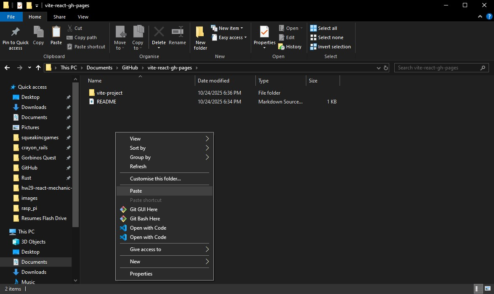

# vite-react-gh-pages
*Guide to deploy vite react app to github pages*

## create repo


## clone repo (github desktop)


## install vite

```bash
npm install vite@latest 
```


## move files to root folder




## change vite.config.js


on **vite.config.js** change the base name to the repo name
example: ```base: '/<REPO>/' ```

mine:
```javascript
import { defineConfig } from 'vite'
import react from '@vitejs/plugin-react'

// https://vite.dev/config/
export default defineConfig({
  plugins: [react()],
  base: '/vite-react-gh-pages/' // Set the base path for GitHub Pages deployment
})
```


## add github workflow deploy file

create **.github/workflows/deploy.yml** with the following content:
```yaml
# Simple workflow for deploying static content to GitHub Pages
name: Deploy static content to Pages

on:
  # Runs on pushes targeting the default branch
  push:
    branches: ['main']

  # Allows you to run this workflow manually from the Actions tab
  workflow_dispatch:

# Sets the GITHUB_TOKEN permissions to allow deployment to GitHub Pages
permissions:
  contents: read
  pages: write
  id-token: write

# Allow one concurrent deployment
concurrency:
  group: 'pages'
  cancel-in-progress: true

jobs:
  # Single deploy job since we're just deploying
  deploy:
    environment:
      name: github-pages
      url: ${{ steps.deployment.outputs.page_url }}
    runs-on: ubuntu-latest
    steps:
      - name: Checkout
        uses: actions/checkout@v5
      - name: Set up Node
        uses: actions/setup-node@v5
        with:
          node-version: lts/*
          cache: 'npm'
      - name: Install dependencies
        run: npm ci
      - name: Build
        run: npm run build
      - name: Setup Pages
        uses: actions/configure-pages@v5
      - name: Upload artifact
        uses: actions/upload-pages-artifact@v4
        with:
          # Upload dist folder
          path: './dist'
      - name: Deploy to GitHub Pages
        id: deployment
        uses: actions/deploy-pages@v4

```


## change settings => pages => source to gh actions


## commit and push all changes


## wait for gh actions to finish


## visit deployed site

https://joeyvigil.github.io/vite-react-gh-pages/


## sources
https://vite.dev/guide/static-deploy.html#github-pages
